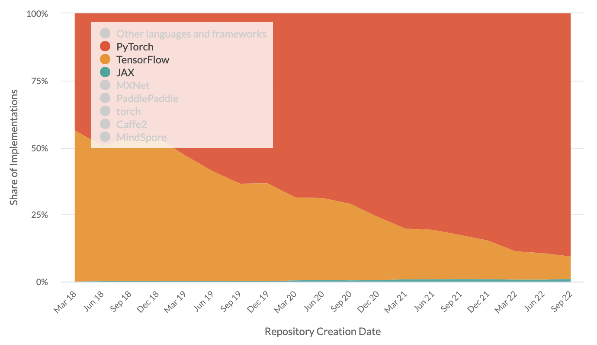
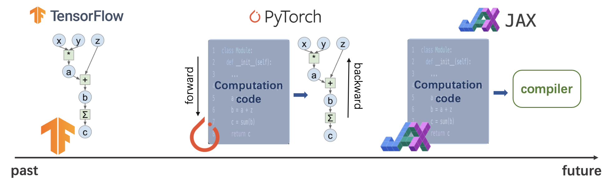

# JAX: A Brief Introduction

<span class="text-lg font-bold mr-1">Yu Yin</span> `@yxonic`

---

# Contents

- The popularity of JAX
- Why JAX?
  - DL framework at its core
  - JAX mechanism
  - The development of DL frameworks
- How to think in JAX?
  - Pure functions
  - Function transformations
  - Application: calculating gradients
  - Application: JIT optimizations
  - Working with high-level DL frameworks
  - Improve your own code

---

# JAX
- What is JAX?
  - A machine learning framework
  - First released in 2018
  - Developed by Google Research teams


---

# DL framework trends



<div class="absolute bottom-8 text-sm text-gray-400">

https://paperswithcode.com/trends

</div>

---

# People using JAX

- DeepMind

> "JAX resonates well with our engineering philosophy and has been widely adopted by our research community over the last year."
>
> ...
>
> "We have found that JAX has enabled rapid experimentation with novel algorithms and architectures and it now underpins many of our recent publications."

- HuggingFace

> "🤗 Hugging Face Diffusers supports Flax (JAX-based framework) since version 0.5.1! This allows for super fast inference on Google TPUs, such as those available in Colab, Kaggle or Google Cloud Platform."


<div class="absolute bottom-8 text-sm text-gray-400">

https://www.deepmind.com/blog/using-jax-to-accelerate-our-research
<br />
https://huggingface.co/blog/stable_diffusion_jax

</div>


---

# Why JAX?

- Why do we need a new DL framework?
- New trend? Google replacing TensorFlow?
- Fancy functionalities?
- Speed?

---

# DL framework at its core

- Low-level:
  - tensor computation
  - auto gradient calculation
  - hardware acceleration
- High-level:
  - NN network definition
  - parameter management
  - optimization
  - training
  - data loading
  - ...

---

# JAX as a faster NumPy

- `jax.numpy` has almost the same API as NumPy
- JAX utilize SIMD/CUDA/TPU whenever possible, which is **fast**!

<div class="mt-4 grid grid-cols-2 gap-6">

```python
import numpy as np

x = np.random.random((10000, 10000))

(x - x.mean(1)) / x.std(1)  # NumPy: 1.81 s
```

```python
import jax.numpy as jnp

x = jnp.array(x)

(x - x.mean(1)) / x.std(1)  # JAX: 410 ms
```

</div>

---

# JAX as an even faster NumPy

- **Compile** functions with JIT (Just-In-Time) for even more acceleration


<div class="mt-4 grid grid-cols-2 gap-6">

```python
def norm(x):
    x = x - x.mean(1, keepdims=True)
    return x / x.std(1, keepdims=True)

norm(x)  # 426 ms
```

```python
from jax import jit

norm_compiled = jit(norm)

norm_compiled(x)  # 218 ms!
```

</div>

---

# Autograd in JAX

- Gradient computation: `jax.grad`
  - Take the original function as input
  - Output the **gradient function**
  - No more `sess.run`, `zero_grad`, `backward`, etc.
- Gradient function can also be accelerated

```python
def f(x):
    return x ** 2

g = jax.grad(f)  # g: x -> 2*x
g(3.0)  # -> 6.0

g_compiled = jax.jit(g)
g_compiled(3.0)  # also 6.0, but faster
```

---

# Define more complex computation

- Strong alignment with math notations
  - Defining networks: math functions that take data and parameters
  - Gradients: w.r.t network parameters
- Automatic vectorisation
  - Define computation for one instance
  - Get batched version with `jax.vmap`

<div class="grid grid-cols-2 gap-6">

```python
def f(w, x):
    return jax.nn.sigmoid(w * x)

def g(w, x, y):
    return (f(w, x) - y) ** 2

grad = jax.grad(g)
grad_batched = \
    jax.vmap(grad, in_axes=(None, 0, 0))
```

<div class="space-y-8">

$$ f(x;w) = \sigma(w \cdot x) $$

$$ g(x, y; w) = \left(f(x;w) - y\right)^2 $$

$$ \nabla_w g = \frac{\partial g}{\partial w} $$

</div>

</div>

---

# The development of DL frameworks

- How did we get here?
- Comparing Tensorflow, PyTorch and JAX
  - Static graph: define-then-run
  - Dynamic graph: define-by-run
  - Compiling: write native code

<div class="absolute bottom-10 left-0 right-0">

</div>

---

# The development of DL frameworks

- Why is JAX the future?
- Design trend:
  - system-centered $\to$ math-centered
  - fixed paradigm $\to$ flexible computation
  - all-in-one framework $\to$ only focus on the core (computation, autograd, acceleration)

<div class="absolute bottom-10 left-0 right-0">

</div>

---

# Why JAX?

- JAX introduces a new thinking model
- With JAX, you should be able to:
  - Think less of *how* computation is run under-the-hood. Think more in math.
  - Design novel computations with more flexibility and convenience.
  - Achieve high performance with JIT, instead of optimizing your code manually.
  - Choose the best tools at each stage of your task. Don't rely on a huge framework anymore.
  - Contribute back to the ecosystem more easily. Write your own framework if you want.

---

# How to think in JAX?

- Pure functions
- Function transformations
- Application: calculating gradients
- Application: JIT optimizations
- Working with high-level DL frameworks
- Improve your own code

---

# Pure functions

- Functions in programming languages are often *impure*
- What are pure functions?
  - defines a mapping
  - all the input data is passed through the function parameters
  - all the results are output through the function results
  - no **side-effect**: 
    - given the same input, returns the same output
    - have no effect on the outside environment
- *Pure functions are math functions*

---

# Pure functions

- More about side-effects:
  - having internal/global states: **not** guaranteed to be the same on each run
  - having extra output: affects the outside environment
- Common side-effects:
  - use global variables / `self` members
  - mutate an array
  - use iterators
  - generate random numbers
  - print to screen
  - save to file
  - ...
- Pure functions should not have **any** side-effect

---

# Purify a stateful calculation

- Many impure functions can be purified
- E.g. in-place mutations

<div class="mt-4 grid grid-cols-2 gap-6">

```python
# impure:

# not allowed in JAX
x[1, :] = 1.0
```

```python
# pure:

# `set` returns a new array
updated_x = x.at[1, :].set(1.0)
```

</div>

---

# Purify a stateful calculation

- E.g. stateful calculation

<div class="mt-4 grid grid-cols-2 gap-6">

```python{all|4,9}
# impure:
class RNN(nn.Module):
  ...
  def forward(self, x):
    self.h = torch.tanh(
        self.w_x * x + self.w_h * self.h
    )
    y = torch.tanh(self.w_o * self.h)
    return y
```

```python{all|2,7}
# pure:
def rnn(params, x, h):
  h = jnp.tanh(
    params.w_x * x + params.w_h * h
  )
  y = jnp.tanh(params.w_o * h)
  return y, h
```

</div>

---

# Purify a stateful calculation

- E.g. auxiliary outputs

<div class="mt-4 grid grid-cols-2 gap-6">

```python{all|5,6}
# impure:
def attention(q, k, v):
    score = ...
    y = ...
    logging.info(score)
    save_score_to_file(filename, score)
    return y
```

```python{all|5}
# pure:
def attention(q, k, v):
    score = ...
    y = ...
    return y, score
```

</div>

---

# Purify a stateful calculation

- E.g. randomness

<div class="mt-4 grid grid-cols-2 gap-6">

<div>

```python
def normal(): # impure
    return np.random.normal()
```

<br />

```python
rng = np.random.default_rng(0)

def normal(rng): # still no, modifies rng
    return rng.normal()
```

</div>

```python{all|5-7|8-9}
key = jax.random.PRNGKey(0)

# pure
def normal(key):
    # split a new key instead of modify
    # the original
    key, subkey = jax.random.split(key)
    # use the new key for generation
    x = jax.random.normal(subkey)
    return x
```

</div>

---

# Why pure functions?

- Math-like functions
  - Declarative instead of imperative
  - focus on *what* instead of *how*
  - less proned to errors
- Data-centric programming
  - build a clear data flow
  - helps clarify complex structures
  - results are more controllable, good for reproducibility
- Enables **function transformation**

---

# Function transformations

- Function transformation: 
  - takes a pure function (transforming impure functions can cause unexpected behaviors)
  - *transforms* it to another pure function
- E.g. `jax.vmap`:
  - input: $f: x \to y$
  - output: $g: \{x_i\} \to \{f(x_i)\}$
  - can be used for batched computation
- Function transformations are composable
  - apply multiple times
  - arbitrary combinations
  - provides more convenience and flexibility

---

# Application: calculating gradients

- Autograd is the core of DL frameworks
- Gradient can be seen as a function transformation
- Apply multiple times to get higher order gradients
- `jax.grad`
  - input: $f: x \to y$
  - output: $g = f'$

---

# Application: JIT optimizations

- JIT can also be seen as a function transformation

```python{all|1|3-5}
g = jax.jit(f)

@jax.jit
def f(...):
    ...
```

- Under-the-hood:
  - Python code $\to$  **compiler function** $\to$ optimized machine code
  - JIT (just-in-time): compilation is done at runtime
  - only pure function can be compiled
- The concept: *embed* a language and its compiler in Python
  - [Apache TVM](https://tvm.apache.org/), [taichi](https://github.com/taichi-dev/taichi), etc.
  - learn more about machine learning compilation (MLC):
    - https://mlc.ai, an open course by Tianqi Chen, CMU

---

# Working with high-level DL frameworks

- JAX offers low-level computation, autograd, and acceleration
- Use high-level frameworks to implement your network faster

---

# Working with high-level DL frameworks

- [Google Flax](https://github.com/google/flax): a neural network library and ecosystem for JAX
- Frameworks by DeepMind:
  - [Haiku](https://github.com/deepmind/dm-haiku): simple neural network library for JAX
  - [Chex](https://github.com/deepmind/chex): utilities for managing and testing network parameters
  - [Optax](https://github.com/deepmind/optax): gradient processing and optimization
  - [RLax](https://github.com/deepmind/rlax): library for implement reinforcement learning agents
  - [Jraph](https://github.com/deepmind/jraph): library for graph neural networks
- You can write your own framework with it:
  - recommender systems?
  - federated learning?

<div class="absolute bottom-8 text-sm text-gray-400">

https://www.deepmind.com/blog/using-jax-to-accelerate-our-research

</div>

---

# Improve your own code

- You don't need to migrate to JAX to benefit from it
  - Apply the way of thinking in your code
  - Use similar tools in your framework of choice

---

# Improve your own code

- Apply the way of thinking: data-centric programming
  - Think of layers as pure data (parameters)
  - Think of methods as pure functions that maps data to data
  - Track your **data flow**: think of how data are generated, transferred, and transformed
  - Good for discovering bugs and performance bottleneck


---

# Improve your own code

- Use similar tools: PyTorch JIT and functorch

<div class="mt-2 grid grid-cols-2 gap-6">

```python{all|11-13}
class MyModule(torch.nn.Module):
  def __init__(self, N, M):
    super().__init__()
    self.weight = \
      torch.nn.Parameter(torch.rand(N, M))
    self.linear = torch.nn.Linear(N, M)
  def forward(self, input):
    output = self.weight.mv(input)
    output = self.linear(output)
    return output
# jit
scripted_module = \
  torch.jit.script(MyModule(2, 3))
```

```python{all|1-6|8-13}
# grad
cos_f = functorch.grad(torch.sin)
cos_f(x) # == x.cos()

neg_sin_f = grad(grad(torch.sin))
neg_sin_f(x) # == -x.sin()

# vmap
w = torch.randn(3, requires_grad=True)
def model(x):
    return feature_vec.dot(w).relu()
examples = torch.randn(batch_size, 3)
result = vmap(model)(examples)
```

</div>


<div class="absolute bottom-8 text-sm text-gray-400">

https://pytorch.org/tutorials/beginner/Intro_to_TorchScript_tutorial.html
<br />
https://pytorch.org/functorch/stable/

</div>

---

# Additional tips on optimization

- Suggestion: spend some time on optimization every now and then.
- Some practical tips:
  - Find the bottleneck before doing anything.
    - Which part of your program costs the most?
    - Is your workload compute-intensive or memory-intensive?
    - Does your program spend too much time on data transfer?
  - Optimize hot functions manually or with JIT.
  - Experiment with smaller model setups first. Scale it up once it works.
  - Try not to load full data in memory. Build a pipeline if possible.
  - Approximations: utilize sparsity, use lower percision floats, etc.

---
layout: center
class: text-center
---

# Learn More

[Documentations](https://sli.dev) · [GitHub](https://github.com/slidevjs/slidev) · [Showcases](https://sli.dev/showcases.html)


<div class="text-sm text-gray-400">

https://www.reddit.com/r/reinforcementlearning/comments/x2izi9/did_anyone_try_torchscript_vs_jax/
<br />
https://theaisummer.com/jax-tensorflow-pytorch/
<br />
https://liuzhian.github.io/2021/04/08/%E5%88%9D%E8%AF%86TorchScript/

</div>
